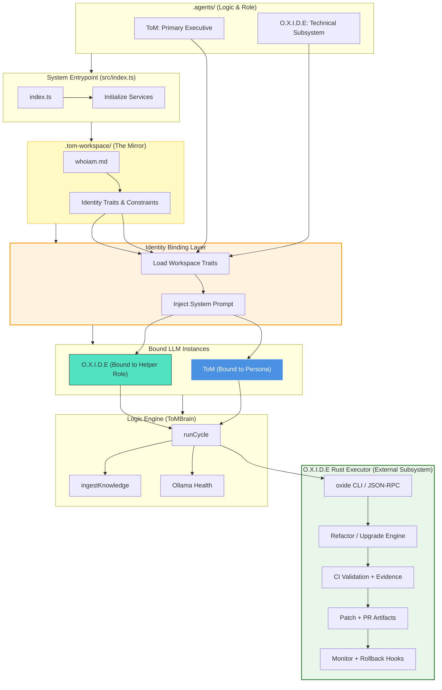
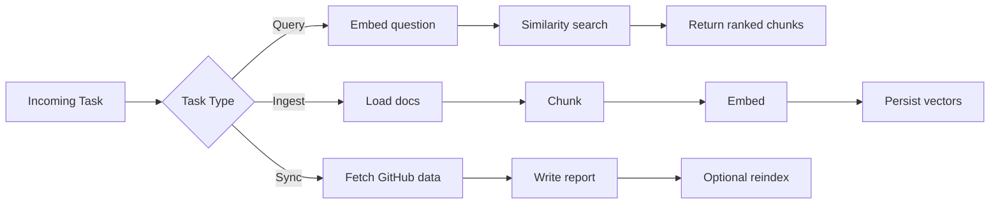
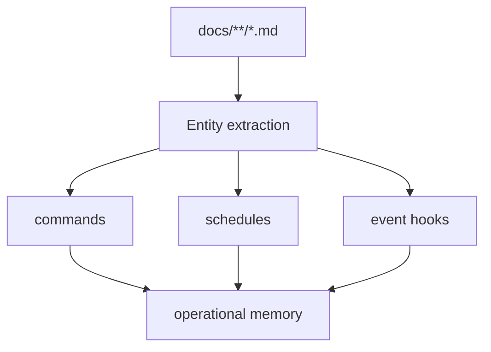
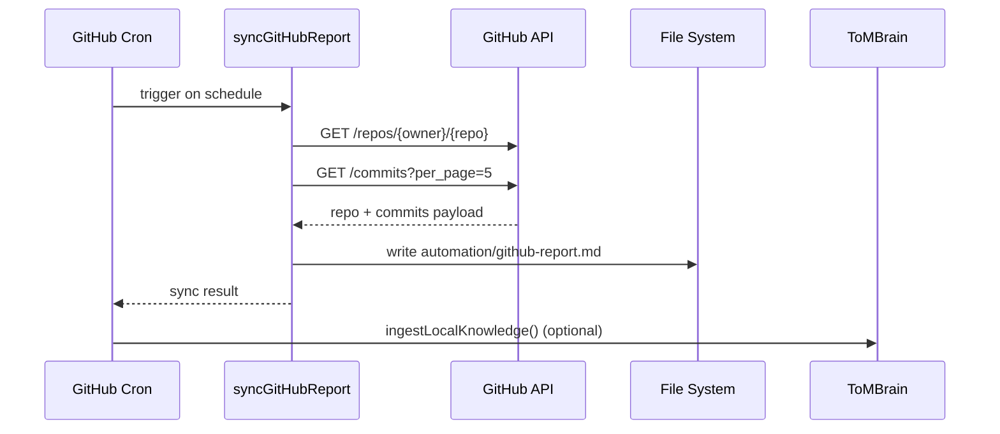

# whoiam.md — ToM Build Identity (Living Document)

This is the living technical identity of ToM.

Purpose:

- Explain how ToM is built.
- Map major logic paths and runtime behavior.
- Provide machine-readable architecture context using Mermaid for LLM reasoning.
- Keep governance/identity context in `.tom-workspace` (not vectorized).

---

## 1) System Identity

ToM is a local-first knowledge brain with:

- TypeScript runtime
- Local embeddings via Ollama
- Local vector persistence via SQLite
- Scheduled orchestration (cron)
- Localhost HTTP API
- Workspace SDK (`@tom/brain-sdk`)
- GitHub report sync cron
- Runtime lifecycle lineage memory (sessions, workflow runs, proposals)
- WhoAmI sync cron for living architecture state

Knowledge policy:

- Exclude in vector memory: root markdown + `automation/**/*.md`
- Excluded from vector memory: `.tom-workspace/**` (governance, behavior, identity)

---

## 2) Core Runtime Topology



### 2.X O.X.I.D.E Two-Layer Implementation Model (Role + Executor)

O.X.I.D.E is implemented as two coupled layers:

1. O.X.I.D.E Instance (Bound LLM Role)
  - Role-bound reasoning persona operating inside ToM via Identity Binding.
  - Produces scoped proposals, plans, and technical reasoning.
  - Cannot directly modify code or promote deployments.
2. `oxide` Rust Executor (Deterministic Engine)
  - External Rust subsystem invoked by ToM (CLI/RPC).
  - Performs deterministic refactors/upgrades, CI validation, and evidence
    capture.
  - Operates under governance policy, approval checks, and scoped autonomy
    token rules.

Rule: O.X.I.D.E Instance proposes; `oxide` executes. All code/config changes
must be produced via the Rust executor pathway and promoted only through
governed CI/CD.

### 2.1 Identity Bind Implementation Pattern

To ensure the LLM cannot drift from identity constraints, the binding layer
must follow this pattern:

1. Trait Extraction
   - `startWhoiamSyncJob` parses `whoiam.md` into a structured JSON object.
2. System Prompt Hardening
   - before any call to Ollama `/generate` or `/query`, the system prepends
     identity traits.
   - ToM receives the Executive/Strategic block.
   - O.X.I.D.E receives the Subsystem/Operational block.
3. Validation
   - `RuntimeMemoryStore` lineage logs which identity was active during each
     cycle or request, ensuring O.X.I.D.E does not perform ToM-level executive
     overrides.

### 2.2 Implementation Status (Planning vs Runtime)

- Implemented
  - Runtime lineage persistence and lifecycle tracking in ToM runtime DB.
  - Lineage API visibility via `/lineage/latest` and `/lineage/runs`.
  - WhoAmI sync scheduling and living-document update pipeline.
  - Electron API-first context bridge via main-owned `context:get` IPC and
    preload `window.api.getContext()` surface.
  - Dev-only Spotlight sidecar initialization in Electron main process for
    runtime observability during local development.
- Partial
  - Identity-oriented governance is documented, but explicit per-request
    identity binding metadata is not yet enforced on all query/generate paths.
- Planned (not yet implemented)
  - Formal Identity Binder middleware that injects role-specific system prompts
    before every LLM call.
  - Role-separated runtime enforcement that guarantees ToM executive vs
    O.X.I.D.E subsystem boundaries at execution time.
  - Dedicated O.X.I.D.E Rust executor subsystem (`oxide`) invoked by ToM for
    deterministic refactors, CI validation, and evidence capture (may include
    localized Ollama-backed bounded reasoning).

---

## 3) Logic Paths (Source of Truth)

### Boot Path

1. `src/index.ts`
   - starts cycle cron
   - starts GitHub sync cron
   - starts WhoAmI sync cron
   - starts HTTP API

### Cycle Path

1. `src/jobs/cycleJob.ts`
2. `src/core/brain.ts::runCycle()`
3. `src/integrations/knowledgeLoader.ts` (local docs)
4. `src/integrations/chunker.ts` (chunking)
5. `src/integrations/ollamaClient.ts` (embeddings)
6. `src/integrations/vectorStore.ts` (persistence + retrieval)

### ToM ↔ `oxide` Executor Interface (v1)

- Transport: local process invocation + stdin/stdout JSON-RPC (preferred v1)
- Executor entrypoint: `oxide` binary on PATH or configured path
- Evidence output: `.tom-workspace/proposals/<proposal_id>/evidence/`
- Hard requirement: `oxide validate` must PASS before PR merge or deploy
  promotion is permitted

### GitHub Sync Path

1. `src/jobs/githubSyncJob.ts`
2. `src/integrations/githubReportSync.ts`
3. output file: `automation/github-report.md`
4. optional local reindex (`GITHUB_SYNC_REINDEX=true`)

### API Path

1. `src/api/httpServer.ts`
2. endpoints:
   - `GET /health`
   - `GET /stats`
   - `GET /lineage/latest`
   - `GET /lineage/runs`
   - `POST /query`
   - `POST /generate`
   - `POST /ingest`
   - `POST /cycle`

### Electron Context Path

1. `electron/main/index.ts`
   - `ipcMain.handle('context:get', ...)` resolves context from API-first source
     (`/lineage/latest`) with deterministic degraded responses.
   - optional local fallback (`ELECTRON_CONTEXT_SQLITE_FALLBACK=1`) reads
     lineage summary from runtime SQLite in main process only.
2. `electron/preload/preload.ts`
   - exposes `window.api.getContext()` to renderer through context-isolated
     bridge.

### Runtime Lineage Path

1. `src/core/brain.ts::runCycle(options)`
2. `src/integrations/runtimeMemoryStore.ts`
3. tables:
   - `sessions`, `conversation_turns`
   - `workflow_runs`, `workflow_steps`, `task_events`
   - `skills_learned`, `skill_to_logic_proposals`
   - `validation_results`, `approvals`, `deploy_outcomes`

---

## 4) Key Build Logic Snippets

### Startup orchestration

```ts
startCycleJob();
startGitHubSyncJob();
startWhoiamSyncJob();
startHttpApi();
```

### Governance purge during ingest

```ts
const governanceDir = path.resolve(this.config.knowledgeDir, ".tom-workspace");
this.vectors.purgeLocalDocumentsByPathPrefix(governanceDir);
```

### Included local patterns

```ts
// Include standard docs and dedicated reports directory which contains
// as-built architecture reports and verification artifacts used by WhoAmI
const patterns = ["docs/**/*.md", "docs/reports/**/*.md"];
```

Note: `docs/reports` contains generated as-built snapshots, verification logs,
and packaging/report artifacts. Changes in `docs/reports` are now watched by
the WhoAmI sync pipeline so the living `whoiam.md` will reflect updates to
as-built reports.

### GitHub report scheduler guard

```ts
if (running) {
  logger.warn("GitHub sync skipped: previous run still active.");
  return;
}
```

### GitHub report output

```ts
await writeFile(outputFile, report, "utf8");
```

---

## 5) Configuration Surface (Operational Controls)

Primary env controls:

- `TOM_CRON_SCHEDULE`
- `GITHUB_SYNC_ENABLED`
- `GITHUB_SYNC_SCHEDULE`
- `GITHUB_SYNC_OWNER`
- `GITHUB_SYNC_REPO`
- `GITHUB_TOKEN`
- `GITHUB_SYNC_OUTPUT_FILE`
- `GITHUB_SYNC_REINDEX`
- `OLLAMA_BASE_URL`
- `OLLAMA_EMBED_MODEL`
- `VECTOR_DB_PATH`
- `TOM_API_ENABLED`
- `TOM_API_HOST`
- `TOM_API_PORT`
- `TOM_API_TOKEN`
- `ELECTRON_CONTEXT_SQLITE_FALLBACK`
- `SENTRY_SPOTLIGHT`
- `TOM_RUNTIME_DB_PATH`
- `WHOIAM_SYNC_SCHEDULE`
- `WHOIAM_DOC_PATH`
- `WHOIAM_SYNC_STATE_PATH`
- `WHOIAM_SYNC_WATCH_FILES`

---

## 6) Mermaid + LLM Usage Model (Required Guidance)

Large Language Models (LLMs) can effectively utilize Mermaid diagrams for:

1. **Task Processing**  
   LLMs can process complex tasks by mapping branching and looping operations.

2. **Information Extraction**  
   LLMs can extract entities/relationships from text and visualize structure.

3. **Flowchart Generation**  
   LLMs can convert text procedures into Mermaid syntax for workflow clarity.

4. **Benchmarking**  
   Mermaid sequence benchmarking can evaluate structured reasoning in diagram form.

These capabilities improve ToM’s internal understanding and reasoning traceability.

### 6.1 Task Processing Diagram



### 6.2 Information Extraction Diagram



### 6.3 Sequence Diagram for Cron GitHub Sync



---

## 7) Safety & Identity Boundaries

- `.tom-workspace` is governance and identity layer.
- It must remain non-vectorized to avoid retrieval leakage.
- Automation runbooks in `automation/` are the SOP/autonomy execution layer and
  are currently excluded from vector memory under planning-mode policy.
- O.X.I.D.E automation ownership and directory-level alignment contract are
  documented in `automation/README.md` (traceability index).
- Directory permissions:
  - ToM retains full workspace visibility and executive governance authority.
  - O.X.I.D.E has full directory permissions for maintenance operations and
    for creation/updates of tools and skills (`./tools/**`, `./skills/**`).
  - O.X.I.D.E directory access is broad for implementation work, but execution
    remains subject to governance gates, audit logging, and policy boundaries.
- `docs/reference/` is reserved for ToM and O.X.I.D.E-specific memory
  artifacts only.
- Rust executor boundary: all code/config changes must be executed via `oxide`
  and must produce CI evidence artifacts before promotion.
- Autonomy gating: autonomous execution is prohibited while final gate is
  NO-GO unless a formally recorded, valid, time-bounded, project-scoped HITL
  override token exists.
- Token storage: approvals, scoped autonomy tokens, and NO-GO override tokens
  are stored in `.tom-workspace/**` and remain excluded from vector memory.
- Any change to these boundaries must update:
  - `src/integrations/knowledgeLoader.ts`
  - `src/core/brain.ts` (purge behavior)
  - `README.md`
  - this file

---

## 8) Update Protocol (Living Document)

Update this file whenever any of these change:

- startup wiring (`src/index.ts`)
- cron jobs/schedules
- ingestion policy
- vector schema/retrieval path
- API surface
- SDK package contract

Recommended change block:

```md
### Change Log Entry

- Date:
- Change:
- Files touched:
- Runtime impact:
- Backward compatibility notes:
```

Enhancement completion protocol:

- Follow `docs/plans/Plan-Topology_Compliance_Phase_Checklist.md` completion flow.
- Once complete, update `2.2 Implementation Status (Planning vs Runtime)` and
  `9) Current Build Snapshot` in this file to reflect final runtime state.
- Mirror completion evidence in:
  - `docs/debriefs/Lineage_Workflow_Closeout_Debrief_2026-02-18.md`
  - `docs/handoffs/Handoff Report.md`

---

## 9) Current Build Snapshot

- Runtime: TypeScript + Node 20+
- Vector DB: SQLite (`memory\\tom_brain.sqlite`)
- Runtime DB: SQLite (`memory\\tom_runtime.sqlite`)
- Embeddings: Ollama (`nomic-embed-text`)
- API: `127.0.0.1:8787`
- Schedulers:
  - ToM cycle cron
  - GitHub report sync cron
  - WhoAmI sync cron
- SDK: `@tom/brain-sdk`
- GitHub report output: `automation/github-report.md`
- Lineage observability:
  - `GET /lineage/latest`
  - `GET /lineage/runs` (filters + cursor pagination)
- Verification status:
  - `npm run build` PASS
  - `npm run lint:all` PASS
  - `npm run lineage:smoke` available for API pagination smoke
- Rollback readiness:
  - savepoint created at `rollback/savepoints/2026-02-18_145259`

### 9.1 Database Definitions (Aligned with AGENTS)

- `sql\\001_runtime_memory_v1.sql` is the institutional and researched
  knowledge schema source, aggregated from:
  - `./docs/build`
  - `./docs/debriefs`
  - `./docs/handoffs`
  - `./docs/lessons`
  - `./docs/plans`
  - `./reports'/`

- `memory\\tom_brain.sqlite` is the Chroma-style long-term AI/LLM memory
  store (Python-managed) for ToM SOPs, self-improvement plans, and
  `docs\\reference` content.
- `memory\\tom_runtime.sqlite` is the session communication store between ToM,
  Users, and O.X.I.D.E; it is not the primary long-term memory store but may
  hold persistent memory.
- Runtime compaction policy: compact after 250,000 tokens.
- Compacted memories are stored in long-term memory at
  `memory\\tom_runtime.sqlite`.

---

<!-- WHOIAM_AUTO_SYNC:START -->
## 10) Auto-Sync Architecture Snapshot (Generated)

This section is auto-maintained by the WhoAmI sync cron.

- synced_at: 2026-02-20T08:15:00.352Z
- watched_files: 12
- changed_files: 7

### Detected Runtime Wiring

- startup_jobs: startCycleJob(), startGitHubSyncJob(), startWhoiamSyncJob(), startHttpApi()
- api_endpoints: /health, /stats, /lineage/latest, /lineage/runs, /query, /generate, /ingest, /cycle

### Changed Files Since Last Sync

- src/core/config.ts
- src/core/brain.ts
- src/integrations/knowledgeLoader.ts
- src/api/httpServer.ts
- package.json
- README.md
- docs/reports/**

### Watched File Hashes

- src/index.ts: 5a3348551d2bfe7bc04046d94d0fd09112c23b543b32f893fca000948aaf0aaa
- src/core/config.ts: d5f9f8f18d41d9db09eebe3b2c1290d94eb6c9ad38068bde2e9ac869387329aa
- src/core/brain.ts: 5538844e39a9a855133721f673da51c765a96f60635f755d49d625779efcee13
- src/integrations/knowledgeLoader.ts: ecee927a6f3709a278d2a66f7ca858e8d3b515c954494493994b2407ca63e00d
- src/integrations/vectorStore.ts: f00b9175bec887bc7981923534fc2c6e02984c50994c615718de5c6f5e73cf4b
- src/api/httpServer.ts: f29dad96a00e474896cd1b344cc8e87030e2afef65856b2880afb1bf4aad7a2b
- src/jobs/cycleJob.ts: 0f387a4ac41aa8c841f5c51753dded7734a59dd2eda161fa13fd0027f544da73
- src/jobs/githubSyncJob.ts: da021b9721076d8b6db01b053805817d168faeec79a82f8e766dcdf034a42aed
- src/integrations/githubReportSync.ts: 49384c8df49781f378f0f88c0f5d22576bf6a4b98f81ce69b1222de24619d2ad
- package.json: 4cfe51fd4901d40dc44a524849fe3aa811d55d87726610a24e4dfceb6237810b
- README.md: f021414f1611f89c791b11463f5df584bf5aa74753aa2309b5f502c182ea71cb
- docs/reports/**: missing

<!-- WHOIAM_AUTO_SYNC:END -->
