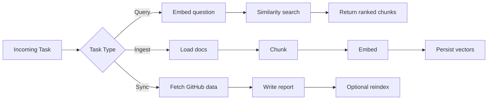
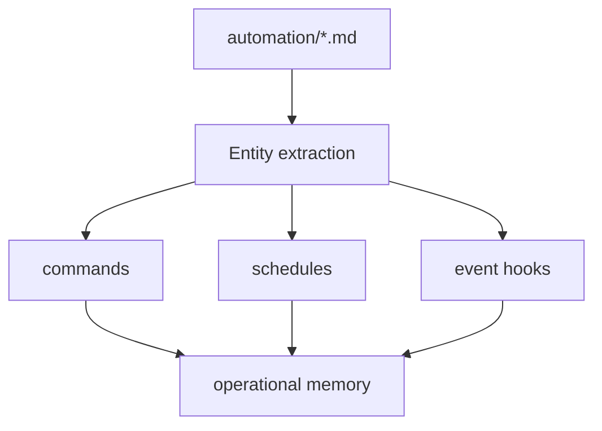
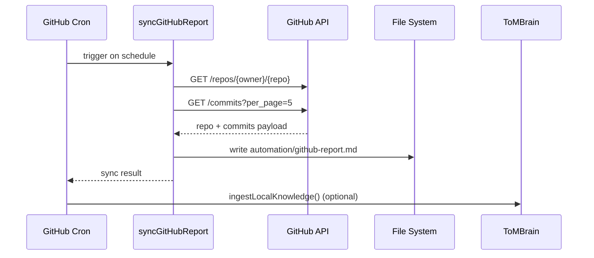

# whoiam.md — ToM Build Identity (Living Document)

This is the living technical identity of ToM.

Purpose:

- Explain how ToM is built.
- Map major logic paths and runtime behavior.
- Provide machine-readable architecture context using Mermaid for LLM reasoning.
- Keep governance/identity context in `.tom-workspace` (not vectorized).

---

## 1) System Identity

ToM is a local-first knowledge brain with:

- TypeScript runtime
- Local embeddings via Ollama
- Local vector persistence via SQLite
- Scheduled orchestration (cron)
- Localhost HTTP API
- Workspace SDK (`@tom/brain-sdk`)
- GitHub report sync cron

Knowledge policy:

- Included in vector memory: root markdown + `automation/**/*.md`
- Excluded from vector memory: `.tom-workspace/**` (governance, behavior, identity)

---

## 2) Core Runtime Topology

```mermaid
flowchart TD
    A[src/index.ts] --> B[startCycleJob]
    A --> C[startGitHubSyncJob]
    A --> D[startHttpApi]

    B --> E[ToMBrain.runCycle]
    E --> F[Ollama health check]
    E --> G[ingestLocalKnowledge]
    E --> H[enrichWithWebKnowledge]

    G --> I[loadKnowledgeDocs]
    I --> J[chunkDocument]
    J --> K[Ollama embed]
    K --> L[VectorStore upsert]

    C --> M[syncGitHubReport]
    M --> N[automation/github-report.md]
    M --> O[optional reindex]

    D --> P[/health /stats /query /ingest /cycle]
    P --> E
```

---

## 3) Logic Paths (Source of Truth)

### Boot Path

1. `src/index.ts`
   - starts cycle cron
   - starts GitHub sync cron
   - starts HTTP API

### Cycle Path

1. `src/jobs/cycleJob.ts`
2. `src/core/brain.ts::runCycle()`
3. `src/integrations/knowledgeLoader.ts` (local docs)
4. `src/integrations/chunker.ts` (chunking)
5. `src/integrations/ollamaClient.ts` (embeddings)
6. `src/integrations/vectorStore.ts` (persistence + retrieval)

### GitHub Sync Path

1. `src/jobs/githubSyncJob.ts`
2. `src/integrations/githubReportSync.ts`
3. output file: `automation/github-report.md`
4. optional local reindex (`GITHUB_SYNC_REINDEX=true`)

### API Path

1. `src/api/httpServer.ts`
2. endpoints:
   - `GET /health`
   - `GET /stats`
   - `POST /query`
   - `POST /ingest`
   - `POST /cycle`

---

## 4) Key Build Logic Snippets

### Startup orchestration

```ts
startCycleJob();
startGitHubSyncJob();
startHttpApi();
```

### Governance purge during ingest

```ts
const governanceDir = path.resolve(this.config.knowledgeDir, ".tom-workspace");
this.vectors.purgeLocalDocumentsByPathPrefix(governanceDir);
```

### Included local patterns

```ts
const patterns = ["*.md", "automation/**/*.md"];
```

### GitHub report scheduler guard

```ts
if (running) {
  logger.warn("GitHub sync skipped: previous run still active.");
  return;
}
```

### GitHub report output

```ts
await writeFile(outputFile, report, "utf8");
```

---

## 5) Configuration Surface (Operational Controls)

Primary env controls:

- `TOM_CRON_SCHEDULE`
- `GITHUB_SYNC_ENABLED`
- `GITHUB_SYNC_SCHEDULE`
- `GITHUB_SYNC_OWNER`
- `GITHUB_SYNC_REPO`
- `GITHUB_TOKEN`
- `GITHUB_SYNC_OUTPUT_FILE`
- `GITHUB_SYNC_REINDEX`
- `OLLAMA_BASE_URL`
- `OLLAMA_EMBED_MODEL`
- `VECTOR_DB_PATH`
- `TOM_API_ENABLED`
- `TOM_API_HOST`
- `TOM_API_PORT`
- `TOM_API_TOKEN`

---

## 6) Mermaid + LLM Usage Model (Required Guidance)

Large Language Models (LLMs) can effectively utilize Mermaid diagrams for:

1. **Task Processing**  
   LLMs can process complex tasks by mapping branching and looping operations.

2. **Information Extraction**  
   LLMs can extract entities/relationships from text and visualize structure.

3. **Flowchart Generation**  
   LLMs can convert text procedures into Mermaid syntax for workflow clarity.

4. **Benchmarking**  
   Mermaid sequence benchmarking can evaluate structured reasoning in diagram form.

These capabilities improve ToM’s internal understanding and reasoning traceability.

### 6.1 Task Processing Diagram



### 6.2 Information Extraction Diagram



### 6.3 Sequence Diagram for Cron GitHub Sync



---

## 7) Safety & Identity Boundaries

- `.tom-workspace` is governance and identity layer.
- It must remain non-vectorized to avoid retrieval leakage.
- Automation runbooks in `automation/` are the SOP/autonomy execution layer.
- Any change to these boundaries must update:
  - `src/integrations/knowledgeLoader.ts`
  - `src/core/brain.ts` (purge behavior)
  - `README.md`
  - this file

---

## 8) Update Protocol (Living Document)

Update this file whenever any of these change:

- startup wiring (`src/index.ts`)
- cron jobs/schedules
- ingestion policy
- vector schema/retrieval path
- API surface
- SDK package contract

Recommended change block:

```md
### Change Log Entry

- Date:
- Change:
- Files touched:
- Runtime impact:
- Backward compatibility notes:
```

---

## 9) Current Build Snapshot

- Runtime: TypeScript + Node 20+
- Vector DB: SQLite (`memory/tom_brain.sqlite`)
- Embeddings: Ollama (`nomic-embed-text`)
- API: `127.0.0.1:8787`
- Schedulers:
  - ToM cycle cron
  - GitHub report sync cron
- SDK: `@tom/brain-sdk`
- GitHub report output: `automation/github-report.md`

---

<!-- WHOIAM_AUTO_SYNC:START -->

## 10) Auto-Sync Architecture Snapshot (Generated)

This section is auto-maintained by the WhoAmI sync cron.

- synced_at: 2026-02-18T16:16:02.934Z
- watched_files: 11
- changed_files: 11

### Detected Runtime Wiring

- startup_jobs: startCycleJob(), startGitHubSyncJob(), startWhoiamSyncJob(), startHttpApi()
- api_endpoints: /health, /stats, /query, /ingest, /cycle

### Changed Files Since Last Sync

- src/index.ts
- src/core/config.ts
- src/core/brain.ts
- src/integrations/knowledgeLoader.ts
- src/integrations/vectorStore.ts
- src/api/httpServer.ts
- src/jobs/cycleJob.ts
- src/jobs/githubSyncJob.ts
- src/integrations/githubReportSync.ts
- package.json
- README.md

### Watched File Hashes

- src/index.ts: 1e757afe4c0c3243fc09a469ae8f6cd7732a7643351986f04b5b2ad46100c2d9
- src/core/config.ts: 6f62e0d0cf5b223d180ffcbec24ca37528dfb1b3b05f502499075e8aca086355
- src/core/brain.ts: a1bdd3253f64af428b1cacbfd1af532d08fe246845fa03a577cfb9c9ceb11708
- src/integrations/knowledgeLoader.ts: 192c01278fb6039acb56b5c5c69b132afe913a63f5811a70a25879d08a840fe4
- src/integrations/vectorStore.ts: 9b8938e16b91f69f9199489b922e94c52acd81f7edd49983983c02415cfaebd2
- src/api/httpServer.ts: 1fbe63a77f36a8c55599afc6d4275054c9afe5a743daa5f50bb27e1ad602bdb6
- src/jobs/cycleJob.ts: cb3e6715d979c86856bd15f0918457a1a5df0f65b4fe548d7d8eb40ff420d664
- src/jobs/githubSyncJob.ts: 1baf6b07df26a7e4c6e11f466cfd3b871ede198d17652dd40aa6b73834680762
- src/integrations/githubReportSync.ts: 9ee906ffd1e4c20fbf7b42e845be8230bcb07ec5c1f2344aa5117b9e7d7b24c4
- package.json: 19f60287f3109f2a29436d8f9caccbbfe265a98633068191aed5a8c5cf9cb2d7
- README.md: 4db0701197c7465b934128c429618e27f9457900d1ca72f519d86e7577fee3f9

<!-- WHOIAM_AUTO_SYNC:END -->
