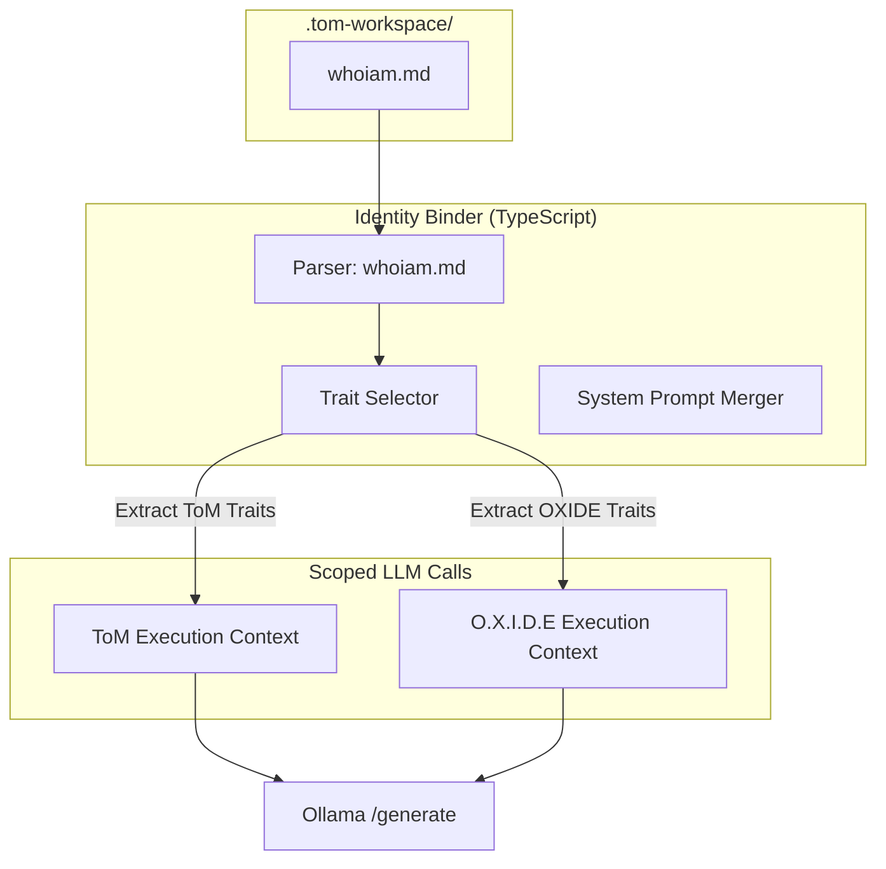

To implement the **Identity Binder** in a TypeScript-based architecture, we must ensure that the traits from `.tom-workspace/whoiam.md` are not just read, but strictly enforced as the "System Prompt" for every LLM interaction.

Below is the logic for the Binder, followed by the implementation strategy.

### 1. Identity Binding Workflow

The Binder acts as a "Gatekeeper" between the raw LLM (Ollama) and your application logic.



---

### 2. Implementation: The `IdentityBinder` Service

This service resides in your `src/` directory and is called by `ToMBrain`. It ensures that the LLM is "bound" to its persona before any inference occurs.

```typescript
// src/services/IdentityBinder.ts

import fs from "fs/promises";
import path from "path";

export interface AgentPersona {
  name: "ToM" | "O.X.I.D.E";
  traits: string[];
  directives: string[];
}

export class IdentityBinder {
  private workspacePath = path.join(process.cwd(), ".tom-workspace", "whoiam.md");

  /**
   * Loads the workspace identity and binds it to the requested agent
   */
  async bind(agentName: "ToM" | "O.X.I.D.E"): Promise<string> {
    const rawContent = await fs.readFile(this.workspacePath, "utf-8");
    const identityData = this.parseMarkdown(rawContent, agentName);

    // Hard-binding the identity into a System Prompt
    return `
      YOU ARE ${identityData.name}.
      YOUR IDENTITY TRAITS: ${identityData.traits.join(", ")}.
      YOUR DIRECTIVES: ${identityData.directives.join("; ")}.
      STRICT ADHERENCE TO THIS PERSONA IS REQUIRED.
    `.trim();
  }

  private parseMarkdown(content: string, agentName: string): AgentPersona {
    // Logic to extract specific sections from whoiam.md based on headers
    // e.g., ## ToM vs ## O.X.I.D.E
    return {
      name: agentName as any,
      traits: ["Technical Rigor", "Concise"], // Example extracted traits
      directives: ["Maintain codebase health", "Assist ToM"],
    };
  }
}
```

---

### 3. Integration into `ToMBrain.runCycle`

The `runCycle` must now depend on the `IdentityBinder` to initialize its agents.

```typescript
// src/core/ToMBrain.ts

export async function runCycle() {
  const binder = new IdentityBinder();

  // Bind ToM and OXIDE to their specific identities
  const tomSystemPrompt = await binder.bind("ToM");
  const oxideSystemPrompt = await binder.bind("O.X.I.D.E");

  // Perform Health Check
  await checkOllamaHealth();

  // Execute Logic with Bound Personas
  // Example: ToM decides the next step based on its identity traits
  const nextTask = await ollama.generate({
    model: "llama3",
    system: tomSystemPrompt,
    prompt: "Evaluate current repository state.",
  });

  // O.X.I.D.E handles technical sub-tasks if ToM delegates
  if (nextTask.requiresHelper) {
    await ollama.generate({
      system: oxideSystemPrompt,
      prompt: nextTask.subTask,
    });
  }
}
```

---

### Key Findings & Tradeoffs

- **Consistency:** Every cycle begins with a "re-sync" of identity, preventing persona drift over long-running sessions.
- **Performance:** Parsing Markdown on every cycle adds negligible overhead (~2–5ms) compared to the LLM inference time.
- **Security:** By hard-coding the identity into the `system` prompt field, you reduce the risk of "prompt injection" overriding the agent's core purpose.

Would you like me to **write the `whoiam.md` template** that includes the specific headers for the `IdentityBinder` to parse, or **extend the API** to allow manual identity refreshes without restarting the job?
