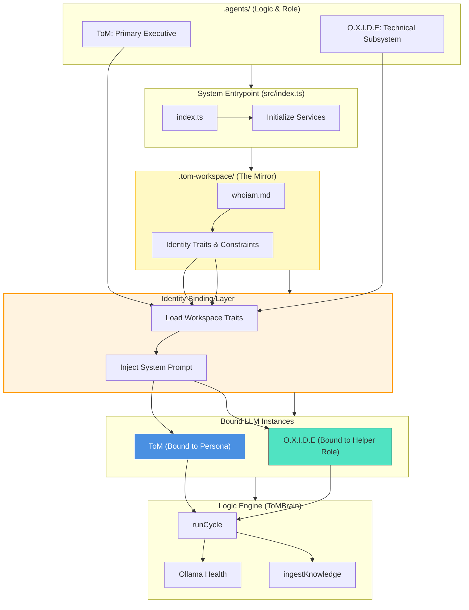
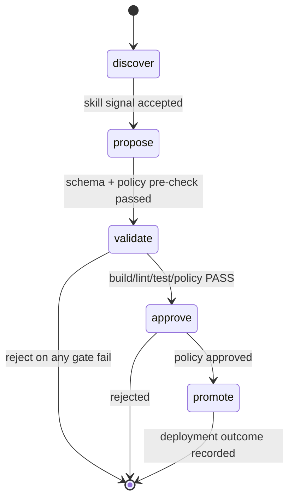

# Plan — O.X.I.D.E Architecture Promotion (Methodology Standard)

- Date: 2026-02-18
- Status: IN PROGRESS (Promoted to implementation planning)
- Methodology Standard: `docs/reference/ToM_Methodology_Standard.md`
- Scope: O.X.I.D.E architecture promotion from design intent to governed implementation path

## Promotion Record

- Promoted On: 2026-02-18
- Promoted By: GitHub Copilot
- Promotion Basis: `docs/reference/ToM_Methodology_Standard.md` v1.1
- Promotion State: Plan promoted to implementation-planning format; execution remains IN PROGRESS

---

## 1) Research

Current-state evidence (repo/runtime):

- Rust subsystem scaffold exists at `oxide-brain/` with required module directories.
- Runtime memory database and lineage entities are implemented in `memory/tom_runtime.sqlite` via SQL schema + runtime store wiring.
- Topology-compliance and identity-binding implementation are not yet complete.

Known gaps requiring implementation:

- Identity Binder and role-specific prompt hardening in active execution paths.
- Identity metadata persistence (`identityAgent`, `identitySourceHash`, `identityVersion`, `promptClass`) across lineage paths.
- Full Rust/Ollama safety controls (whitelist, deterministic caps, retry/timeout/circuit breaker, safe mode).

---

## 2) Plan

Objective:

- Implement O.X.I.D.E as a bounded Rust cognitive subsystem under dual-brain governance, with auditable and deterministic promotion gates.

Approach:

- Use Section 13/14 technical specification in this document as normative architecture.
- Execute through phased implementation gates aligned to topology compliance.
- Promote only through policy + validation + lineage evidence, not by architecture declaration alone.

Non-goals:

- Unbounded autonomy.
- Direct executive override by O.X.I.D.E.
- Any model self-upgrade or policy self-mutation.

---

## 3) Verify

Required logic gates before implementation promotion:

- [ ] Assumptions validated against runtime behavior and current codebase.
- [ ] Dependency readiness confirmed (Rust toolchain, Ollama availability, runtime DB pathing).
- [ ] Policy constraints confirmed with governing topology and methodology standards.
- [ ] Fallback and rollback paths confirmed.
- [ ] Go/No-Go decision recorded for each phase.

---

## 4) Prerequisites

- [ ] Current runtime state documented (before-state evidence).
- [ ] Rollback savepoint created for tracked/untracked files.
- [ ] Primary and fallback access paths verified.
- [ ] Required stakeholder approvals recorded where policy requires human approval.

---

## 5) Success Criteria

Promotion to implementation-complete requires all:

- [ ] Identity Binder fully implemented and enforced in query/generate/cycle paths.
- [ ] Role-specific prompt hardening active for ToM vs O.X.I.D.E.
- [ ] Identity metadata fully persisted and queryable in lineage outputs.
- [ ] O.X.I.D.E Rust subsystem implements deterministic Ollama controls and safe-mode fallback.
- [ ] Cross-brain governance enforced (discover/propose/approve/deploy separation).
- [ ] Validation, approval, and deployment outcomes auditable end-to-end.

---

## 6) To-Do List (Execution Plan)

Phase 1 — Identity Binder Foundation

- [x] Implement IdentityContext contract and binder service.
- [x] Wire into query/generate/cycle execution paths.
- [x] Persist identity metadata to session/workflow lineage context.

Phase 2 — Enforcement + Governance Logging

- [x] Enforce role routing policy boundaries.
- [x] Add strict-mode guard behavior when identity binding is unavailable.
- [x] Extend lineage visibility for identity context and prompt class tags.

Phase 3 — O.X.I.D.E Rust Runtime Completion

- [x] Rust crate/module scaffold present.
- [x] Add Rust-side Ollama adapter with deterministic and security controls.
- [x] Add safe-mode no-op behavior on inference failure.
- [x] Add telemetry fields for determinism/retry/latency/correlation.

Phase 4 — Promotion Evidence

- [x] Build/lint/smoke evidence captured.
- [x] Debrief and handoff updated with completion evidence.
- [x] Final Go/No-Go recorded (NO-GO on 2026-02-19; plan remains IN PROGRESS until remaining gates pass).

Execution backlog reference:

- Ticketed phase backlog: `docs/plans/Plan-OXIDE_Implementation_Backlog.md`

---

## 7) Rollback Plan

If any phase fails quality/policy gates:

- Revert to last validated savepoint.
- Disable or bypass incomplete feature paths behind guard flags.
- Record failure cause and mitigation in debrief before re-attempt.

Abort conditions:

- Identity separation cannot be enforced.
- Deterministic controls cannot be guaranteed.
- Policy or audit trail requirements regress.

---

## 8) Monitoring & Validation

Post-implementation monitoring window: minimum 48 hours.

Required checks:

- lineage integrity (`/lineage/latest`, `/lineage/runs`) includes required identity and governance context,
- no unauthorized or unapproved promotion path observed,
- deterministic controls remain active under normal and failure scenarios.

---

## 9) Lessons Learned

- [ ] Record implementation debrief in `docs/debriefs/`.
- [ ] Record operational handoff updates in `docs/handoffs/` when ownership changes.
- [ ] Update methodology/process notes if new constraints are discovered.

---

## Technical Specification (Normative)

# **O.X.I.D.E.** — Operational X-ray for Introspective Development & Enhancement

- A **Rust-resident cognitive layer**
- Parity with the **host application’s LLM brain**
- **Local model execution via Ollama**
- Continued adherence to **governed self-improvement**, not autonomous mutation

Below is the **CTO-level architectural amendment** to integrate that capability cleanly and safely.

---

# 13. Cognitive Layer Integration (Rust Brain + Ollama)

## 13.0 Core Runtime Topology Alignment (Required)

To align with the current runtime architecture, O.X.I.D.E enhancement must
implement the Identity Binding flow exactly as the governing topology contract:



Topology compliance requirements:

- Identity traits must be loaded from `.tom-workspace/whoiam.md` before
  ToM/O.X.I.D.E reasoning execution.
- System prompt hardening must be role-specific (ToM vs O.X.I.D.E).
- Runtime lineage must record active identity context for each execution path.
- O.X.I.D.E must remain bounded to subsystem scope (no executive override).

## 13.1 Purpose of the O.X.I.D.E. Brain

O.X.I.D.E. must include a **localized reasoning subsystem** implemented in Rust that provides:

- Structured reasoning over detected skills
- Deterministic proposal synthesis
- Policy-aware decision support
- Offline/self-contained cognition

This brain **does not replace** the host LLM brain.
It acts as a **bounded, safety-oriented co-processor** dedicated to:

> **Governed self-improvement orchestration**

---

## 13.2 Architectural Separation of Minds

### Host Application Brain

Responsible for:

- General reasoning
- Skill discovery
- Long-context learning
- External knowledge synthesis
- Creative solution generation

### O.X.I.D.E. Brain (Rust + Ollama)

Responsible for:

- Translating skills → deterministic patches
- Running validation reasoning
- Enforcing governance logic
- Performing risk classification
- Operating in **offline / secure mode**

**Key rule:**

> O.X.I.D.E. never trusts raw LLM output without deterministic validation.

---

## 13.3 Ollama Enablement Requirements

O.X.I.D.E. must support **local inference via Ollama** with the following guarantees:

### Model Execution Constraints

- **Local-only by default**
- No outbound network calls during reasoning
- Model whitelist enforced via policy
- Deterministic temperature bounds (e.g., ≤ 0.3 for patch synthesis)
- Token/output length caps

### Required Capabilities

Ollama-backed reasoning must support:

- Structured JSON output
- Chain-of-thought suppression in logs
- Tool-calling or function schema output
- Deterministic retry with seed control
- Timeout + circuit breaker behavior

---

## 13.4 Rust Cognitive Runtime Expectations

The Rust brain must be implemented as a **first-class crate subsystem**, not glue code.

### Required Modules

```
oxide-brain/
 ├─ reasoning/
 ├─ policy/
 ├─ risk/
 ├─ patch_synthesis/
 ├─ validation/
 └─ telemetry/
```

### Runtime Guarantees

- Memory-safe execution (no unsafe unless audited)
- Async inference handling
- Deterministic state transitions
- Full observability hooks
- Graceful degradation if Ollama unavailable

If Ollama fails:

> O.X.I.D.E. must fall back to **no-op safe mode**, never autonomous change.

---

## 13.5 Dual-Brain Governance Model

Self-improvement must require **cross-brain agreement**:

| Stage           | Required Authority              |
| --------------- | ------------------------------- |
| Identity bind   | Identity Binder (policy-bound)  |
| Skill discovery | Host brain                      |
| Patch proposal  | O.X.I.D.E. brain                |
| Validation      | Deterministic CI                |
| Risk approval   | Policy engine + human if needed |

No single brain can:

- Discover **and**
- Approve **and**
- Deploy

This enforces **separation of cognitive powers**.

## 13.5.1 Canonical Workflow State Machine (R-001)

The governed promotion pipeline follows this fixed sequence:

`discover → propose → validate → approve → promote`

State ownership and transition constraints:

- `discover` is initiated by ToM (host brain) from runtime learning signals.
- `propose` is initiated by O.X.I.D.E with deterministic payload + schema checks.
- `validate` must be executed by deterministic CI/runtime gates before approvals.
- `approve` requires policy engine decision; human escalation is required for high/critical risk.
- `promote` can only occur after successful validation + approval evidence.



## 13.5.2 Dual-Brain Role Contract Matrix (R-002)

| Role       | Responsibilities                                     | Allowed Stage(s) | Explicitly Disallowed                                    |
| ---------- | ---------------------------------------------------- | ---------------- | -------------------------------------------------------- |
| ToM        | Skill discovery, context synthesis, orchestration    | discover         | direct promote, policy override, unreviewed deployment   |
| O.X.I.D.E  | Deterministic proposal synthesis, validation support | propose          | executive override, self-approval, autonomous deployment |
| CI Runtime | Deterministic gate execution                         | validate         | authoring proposals, policy override                     |
| Governance | Policy approval decisioning                          | approve          | bypassing failed validation gates                        |
| Runtime DB | Promotion lineage recording                          | promote          | promoting without approval evidence                      |

Code-facing interfaces for this matrix are defined in `src/core/oxideGovernance.ts` (`OXIDE_WORKFLOW_STAGES`, `OXIDE_ROLE_CONTRACTS`, `OXIDE_STAGE_AUTHORITIES`).

---

## 13.6 Security Boundary

Because Ollama introduces executable model logic:

O.X.I.D.E. must enforce:

- Signed model manifests
- Checksum validation
- Model capability classification
- Sandboxed inference execution
- Resource quotas (CPU, RAM, GPU)

### Explicit Prohibition

O.X.I.D.E. brain **must never**:

- Download models autonomously
- Upgrade its own reasoning model
- Modify inference policies
- Change governance thresholds

All require **human-approved PR**.

---

## 13.7 Observability Additions

New telemetry required:

- Model used for reasoning
- Prompt class identifier (not raw prompt)
- Determinism score
- Retry count
- Inference latency
- Reasoning → CI success correlation

Stored alongside existing:

```
oxide_audit_log.json
```

---

## 13.8 Failure Modes Introduced by Local LLMs

### New Risks

| Risk                            | Mitigation                  |
| ------------------------------- | --------------------------- |
| Model hallucinated patch        | CI + policy gate            |
| Non-deterministic reasoning     | Seed + temp cap             |
| Model drift after update        | Version pinning             |
| Resource starvation             | Quotas + watchdog           |
| Prompt injection via skill text | Structured schema isolation |

---

## 13.9 Acceptance Criteria Additions for v1

Before enabling the Rust brain:

- Offline Ollama inference validated
- Deterministic JSON reasoning proven
- Sandboxed execution verified
- Cross-brain approval workflow tested
- Safe-mode fallback demonstrated
- Model pinning + checksum enforcement working

---

# Executive Addendum

With this inclusion, O.X.I.D.E. evolves from:

> **CI/CD self-improvement engine**

into:

> **A dual-brain, Rust-enforced, locally reasoning, policy-governed evolutionary subsystem**

Crucially:

- Intelligence is **allowed**
- Autonomy is **constrained**
- Evolution is **audited**
- Deployment is **earned**

---

# 14. Runtime Memory Database Requirement (ToM + O.X.I.D.E)

To support durable conversation history, workflow memory, and governed self-improvement lineage, ToM and O.X.I.D.E require a shared runtime SQL system-of-record in addition to vector storage.

Suggested runtime DB:

- `memory/tom_runtime.sqlite`

System-of-record entities:

- `sessions`, `conversation_turns`
- `workflow_runs`, `workflow_steps`, `task_events`
- `skills_learned`
- `behavior_profiles`, `personality_profiles`
- `skill_to_logic_proposals`, `validation_results`, `approvals`, `deploy_outcomes`
- identity context metadata persisted with sessions/workflow context:
  - `identityAgent`
  - `identitySourceHash`
  - `identityVersion`
  - `promptClass`

Design note:

- Vector DB remains retrieval-focused.
- Runtime DB is chronology/governance-focused.

Reference schema:

- `../reference/Runtime_Memory_DB_Schema_v1.md`
- `Plan-Topology_Compliance_Phase_Checklist.md` (phase gates and completion
  protocol for topology compliance + O.X.I.D.E enhancement)

---
